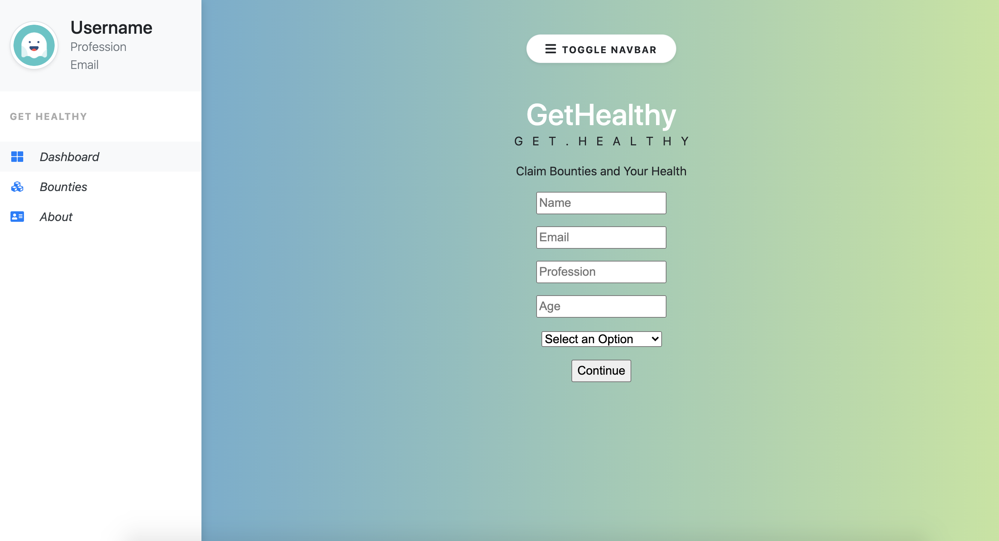
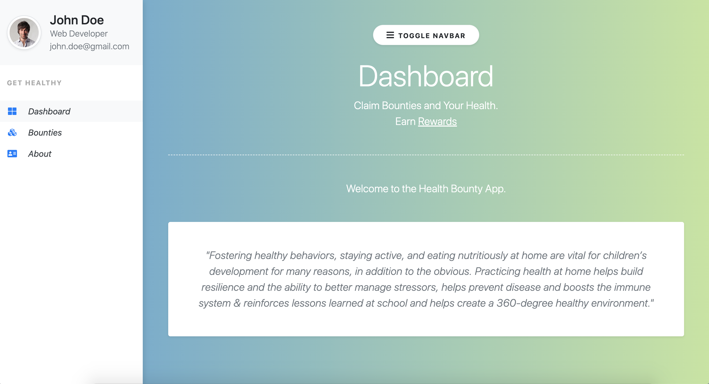
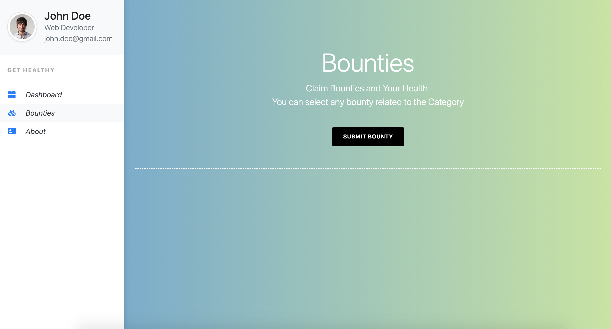
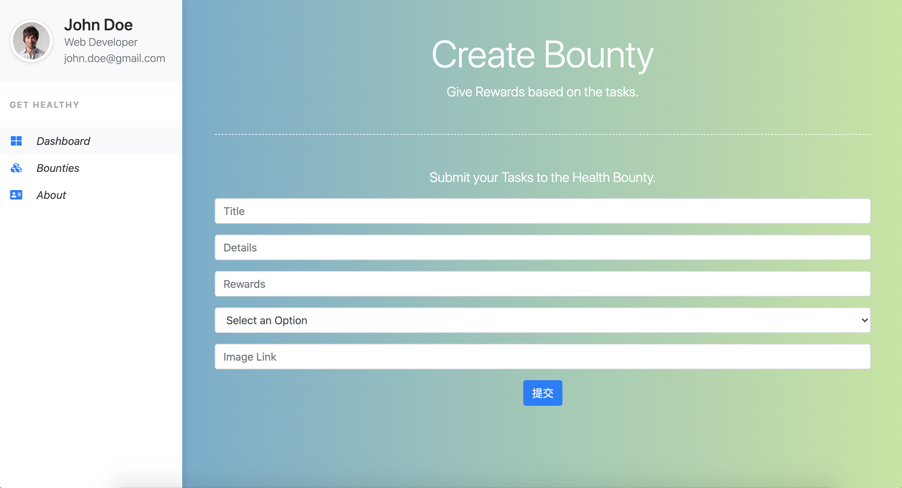

# HackZurich 2020

This is the final project for HackZurich 2020 CSS Challenge.

|  homepage |  dashboard | 
|---|---|
|  |   | 
|bounty|survey|
|   |  |  

## Why we built it

We wanted to help people who don't take their health life seriously.

## What does it do

It connects people who wish to motivate less sporty people, with couch-potatoes. With the money incentive, everyone can receive certain financial reward(either cash or not) by exercising.

## How we built it

The web app is powered by [Flask](https://flask.palletsprojects.com/en/1.1.x/). Tech stack we used include but not limit to: bootstrap css3, html5, javascript, jquery, opencv, posenet, python, sqlite, tensorflow;
